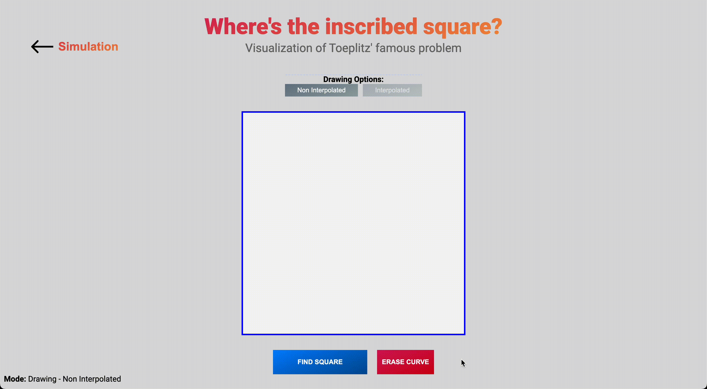

# Toeplitz' Visualization
Visualization of the famous unsolved problem by mathematician Otto Toeplitz proposed in 1911.

# The problem
The Toeplitz' Conjecture or inscribed square problem, is an open problem in the field of geometry and topology. It asks whether every Jordan Curve (a simple closed curve) in R^2 contains the vertices of a square.

## More formally: 
Let $\gamma: \mathbb{R}/L\mathbb{Z} \rightarrow \mathbb{R}^2$ be a simple closed curve. Then $\gamma(\mathbb{R}/L\mathbb{Z})$ inscribes a square. (Terence Tao)

It is widely believed that the conjecture holds true, i.e. that it is indeed possible to inscribe a square in every Jordan Curve. However, the conjecture still couldn't be proved.
The fact that it is a still-open problem captivates me, motivating my desire to build this visualisation: to lay intuition for the problem (and perhaps also persuade my self of its probable veracity ;))

# The visualisation
## Simulation Mode
In this mode **random generated Jordan Curves** are automatically traversed and inscribed squares are found. 
* "Alter Circle": This Simulation Strategy uses a circle with random radius and position on the canvas as a starting point and adds random points to the path in the correct order. It also generates a random path from the circle to this tip-point and back with varying complexity.

* "TSP": This Strategy sets random points on the canvas in order to connect and order them. This is done with the Travelling Salesman Problem (TSP) - heuristic "Nearest Neighbor Insertion" in $O(n^2)$

## Algorithm for finding squares on interpolated curves
After calculating the maximum distance two points can have on the curve, the algo traverses the Bézier-splines of the whole curve and checks for squares $\leq$ the found maximum distance. Continuing with finding "candidate-points" for a specific reference point and distance, the algo checks these candidates recursively with backtracking in order to find squares.

### Optimisations
#### Inferring
If the curve is split into many Bézier-splines, the process of finding squares can take a long time. In order to shorten the calculation time, the algo uses "inferring" to make the steps, in which it is traversing the curves, bigger or smaller respectively:

When the temporal derivative of the distance from the currently considered point to the reference point increases, the steps also increase linearly. When the derivative decreases, the steps decrease exponentially (since the probability of finding a good point is immediately increased), thus leveraging the continuity property of the curves.

#### Tweaking the parameters based on the complexity of the curve
Since there are more Bézier-splines with complex curves, the start step-size, which the single splines are traversed with, can be accordingly increased. This idea is also helping when it comes to the length of these splines: For shorter splines, the step-size has to be increased.

## Drawing mode
Lets the user draw own Jordan Curves. Before the algo (either interpolated or non interpolated) is called to traverse the curve, it is checked for self intersections.

